# 🏗️ ThumbBot System Architecture

Comprehensive documentation of the ThumbBot media download system architecture, including service interactions, data flows, and technical implementation details.

## 🎯 System Overview

ThumbBot is a microservices-based Discord bot system that automatically downloads and shares media from various social platforms. The system consists of three main components working together to provide seamless media sharing in Discord servers.

### High-Level Architecture


### Technology Stack

| Component | Technology | Purpose | Port |
|-----------|------------|---------|------|
| **ThumbBot Bot** | Node.js/TypeScript | Discord interface | 3000 |
| **ThumbBot Downloader** | Python/FastAPI | Media processing | 8001 |
| **Cobalt** | Node.js (Docker) | Media extraction | 9000 |
| **Docker Network** | Bridge Network | Inter-service communication | - |
| **Prometheus** | Metrics collection | Monitoring (optional) | 3001, 8002 |

## 🔄 Inter-Service Communication

### Request Flow Sequence

```mermaid
sequenceDiagram
    participant U as User
    participant D as Discord
    participant TB as ThumbBot Bot
    participant TD as Downloader
    participant C as Cobalt
    participant P as Platform (IG/TT/YT)

    U->>D: Posts media URL
    D->>TB: Message event with URL
    TB->>TB: Detect & validate URL
    TB->>D: React with ⏳ (processing)
    
    TB->>+TD: POST /videos<br/>{url, channelId}
    TD->>TD: Validate request
    TD->>+C: POST /api/json<br/>{url, picker: "all"}
    
    alt Single Media
        C->>TD: {status: "stream", url: "direct_url"}
        TD->>P: Download file
        P->>TD: Media file
        TD->>D: Upload single file
    else Multiple Media (Picker)
        C->>TD: {status: "picker", picker: [...]}
        loop For each picker item
            TD->>P: Download file
            P->>TD: Media file
        end
        TD->>D: Upload all files in single message
    end
    
    C->>-TD: Response complete
    TD->>-TB: {success: true}
    TB->>D: Remove ⏳ reaction
    D->>U: Display media files
```



### HTTP API Communication

**Bot → Downloader:**
```http
POST /videos HTTP/1.1
Host: thumbbot-downloader:8001
Content-Type: application/json

{
  "url": "https://www.instagram.com/p/DMsrx6ysS-v/",
  "channelId": "1234567890123456789"
}
```

**Downloader → Cobalt:**
```http
POST /api/json HTTP/1.1  
Host: thumbbot-cobalt:9000
Content-Type: application/json

{
  "url": "https://www.instagram.com/p/DMsrx6ysS-v/",
  "vQuality": "720",
  "vCodec": "h264",
  "aFormat": "mp3",
  "filenamePattern": "basic",
  "picker": "all"
}
```

### Error Propagation

```mermaid
flowchart TD
    A[User Posts URL] --> B[Bot Detects URL]
    B --> C[Bot Validates URL]
    C --> D{URL Valid?}
    
    D -->|No| E[Bot Ignores]
    D -->|Yes| F[Bot Adds ⏳ Reaction]
    
    F --> G[POST to Downloader]
    G --> H{Downloader Available?}
    
    H -->|No| I[Network Error]
    H -->|Yes| J[Downloader Processes]
    
    J --> K[Call Cobalt API]
    K --> L{Cobalt Response?}
    
    L -->|Error| M[Platform Error]
    L -->|Success| N[Download Files]
    
    N --> O{Download Success?}
    O -->|No| P[Download Error]
    O -->|Yes| Q[Upload to Discord]
    
    Q --> R{Upload Success?}
    R -->|No| S[Upload Error]
    R -->|Yes| T[Success Response]
    
    I --> U[Bot: ❌ Reaction]
    M --> U
    P --> U
    S --> U
    T --> V[Bot: ✅ Reaction]
    
    style U fill:#ffebee
    style V fill:#e8f5e8
```



## 🐳 Docker Architecture

### Container Overview


### Network Configuration

**Bridge Network:** `thumbbot-network`
- **Purpose:** Isolated container communication
- **DNS Resolution:** Containers accessible by service name
- **Port Mapping:** Host ports mapped to container ports

**Service Discovery:**
```yaml
# Internal container communication
thumbbot-bot → thumbbot-downloader:8001
thumbbot-downloader → thumbbot-cobalt:9000

# External host access
Host → localhost:3000 (Bot API)
Host → localhost:8001 (Downloader API)  
Host → localhost:9000 (Cobalt API)
```

### Volume Management

**thumbbot-downloader volumes:**
```yaml
volumes:
  - ./thumbot_downloader/temp_videos:/app/temp_videos
```

**Purpose:**
- **Temporary Storage:** Downloaded files before Discord upload
- **Debug Access:** Host can inspect downloaded files
- **Persistence:** Files survive container restarts (until cleanup)

### Service Dependencies


**Startup Order:**
1. **Cobalt** starts first (media extraction service)
2. **Downloader** starts after Cobalt (depends on Cobalt API)
3. **Bot** starts last (depends on Downloader API)

## 🔒 Security Considerations

### Token Management

**Discord Bot Token:**
- **Storage:** Environment variable `DISCORD_TOKEN`
- **Scope:** Required by both Bot and Downloader services
- **Permissions:** Send Messages, Attach Files, Add Reactions
- **Rotation:** Manual token regeneration in Discord Developer Portal

**Security Best Practices:**
```bash
# Environment file protection
.env files are gitignored
Docker secrets (future enhancement)
Token validation on startup
```

### File Access & Cleanup

**Temporary Files:**
- **Location:** `/app/temp_videos/` (containerized)
- **Permissions:** Container-local access only
- **Cleanup:** Automatic deletion after Discord upload
- **Isolation:** No persistent storage of user content

**Security Measures:**
```python
# File validation
max_file_size = 8MB (configurable)
filename_sanitization = True
auto_cleanup = True (default)
timeout_limits = 60 seconds
```

### Network Security

**Container Network:**
- **Isolation:** Bridge network separates services from host
- **Internal Communication:** Service-to-service only
- **Port Exposure:** Only necessary ports exposed to host
- **External Access:** Only outbound HTTPS to platforms

**API Security:**
```typescript
// Input validation
url_validation = true
channel_id_validation = true
request_timeout = 30_seconds
rate_limiting = Discord_API_limits
```

## 📈 Scaling & Performance

### Resource Requirements

| Service | CPU | Memory | Disk | Network |
|---------|-----|--------|------|---------|
| **Bot** | 0.1-0.5 cores | 128-256MB | Minimal | Low |
| **Downloader** | 0.5-1.0 cores | 256-512MB | 1GB temp | Medium |
| **Cobalt** | 0.5-1.0 cores | 512MB-1GB | Minimal | Medium |
| **Total** | 1.1-2.5 cores | ~1GB | 1GB | Medium |

### Bottlenecks & Limitations

**Performance Bottlenecks:**
1. **File Download Speed:** Limited by platform APIs and network
2. **Discord Upload Rate:** Discord API rate limits (50 requests/sec)
3. **Cobalt Processing:** CPU-intensive video processing
4. **Concurrent Requests:** Single-threaded download processing

**Scaling Limitations:**
```yaml
Current Limitations:
  - Single downloader instance
  - No request queuing
  - Memory-based temporary storage
  - No horizontal scaling

Future Enhancements:
  - Multiple downloader replicas
  - Redis-based job queue
  - Shared storage (S3, etc.)
  - Load balancing
```

### Monitoring Points

**Key Metrics:**
```prometheus
# Request volume
bot_messages_processed_total
download_requests_total

# Performance
download_request_duration_seconds
file_upload_duration_seconds

# Errors
download_errors_total
discord_api_errors_total

# Resources
container_memory_usage_bytes
container_cpu_usage_seconds_total
```

**Health Checks:**
```bash
# Service health
GET /health → {status: "healthy"}

# Dependency health
Cobalt API availability
Discord API connectivity
File system write access
```

## 🔧 Configuration Management

### Environment Variables Flow


### Configuration Hierarchy
1. **Environment Variables** (highest priority)
2. **Docker Compose Variables**
3. **Default Values** (lowest priority)

### Service-Specific Configuration

**Bot Configuration:**
```typescript
interface BotConfig {
  discordToken: string;        // Required
  downloaderHost: string;      // Default: 'thumbbot-downloader'
  downloaderPort: number;      // Default: 8001
  logLevel: string;           // Default: 'info'
  metricsPort: number;        // Default: 3001
}
```

**Downloader Configuration:**
```python
@dataclass
class DownloaderConfig:
    discord_token: str          # Required
    cobalt_api_url: str        # Default: 'http://thumbbot-cobalt:9000'
    picker_behavior: str       # Default: 'all'
    max_file_size_mb: float   # Default: 8.0
    log_level: str            # Default: 'INFO'
```

## 🚀 Deployment Scenarios

### Development Deployment
```bash
# Local development with hot reload
cd thumbot_bot && npm run dev
cd thumbot_downloader && python main.py

# Docker development environment
docker-compose up --build
```

### Production Deployment
```bash
# Production with restart policies
docker-compose up -d

# Health monitoring
docker-compose ps
curl http://localhost:3000/health
curl http://localhost:8001/health
```

### High Availability Deployment
```yaml
# Future enhancement - Multiple replicas
services:
  thumbbot-downloader:
    deploy:
      replicas: 3
    depends_on:
      - redis-queue
      - shared-storage
```

## 🔄 Data Flow Examples

### Single Video Processing

```mermaid
flowchart TD
    A["User posts:<br/>youtube.com/watch?v=123"] --> B[Bot detects YouTube URL]
    B --> C[Bot validates URL format]
    C --> D[Bot adds ⏳ reaction]
    D --> E["POST /videos<br/>{url, channelId}"]
    E --> F[Downloader validates request]
    F --> G["Cobalt API call:<br/>{url, picker: 'all'}"]
    G --> H["Cobalt response:<br/>{status: 'stream', url: 'direct'}"]
    H --> I[Download single MP4 file]
    I --> J[Upload file to Discord]
    J --> K[Cleanup temp file]
    K --> L["Return success response"]
    L --> M[Bot removes ⏳, adds ✅]
    
    style A fill:#e3f2fd
    style M fill:#e8f5e8
```



### Multi-file Album Processing

```mermaid
flowchart TD
    A["User posts:<br/>instagram.com/p/album123"] --> B[Bot detects Instagram URL]
    B --> C[Bot validates URL format]
    C --> D[Bot adds ⏳ reaction]
    D --> E["POST /videos<br/>{url, channelId}"]
    E --> F[Downloader validates request]
    F --> G["Cobalt API call:<br/>{url, picker: 'all'}"]
    G --> H["Cobalt response:<br/>{status: 'picker', picker: [url1, url2, url3]}"]
    H --> I[Download 3 image files]
    I --> J[Upload all 3 files in single Discord message]
    J --> K[Cleanup temp files]
    K --> L["Return success response"]
    L --> M[Bot removes ⏳, adds ✅]
    
    style A fill:#e3f2fd
    style H fill:#fff3e0
    style J fill:#f3e5f5
    style M fill:#e8f5e8
```



## 🔗 Integration Points

### External API Dependencies

**Discord API:**
```typescript
// Bot → Discord
client.on('messageCreate', message => { ... });
await message.react('⏳');

// Downloader → Discord
const response = await fetch('https://discord.com/api/v10/channels/{id}/messages', {
  method: 'POST',
  headers: { Authorization: `Bot ${token}` },
  body: formData
});
```

**Cobalt API:**
```python
# Downloader → Cobalt
response = requests.post(f"{cobalt_url}/api/json", json={
    "url": video_url,
    "vQuality": "720",
    "picker": "all"
})
```

**Platform APIs (Indirect via Cobalt):**
- Instagram Graph API
- TikTok Web API  
- YouTube Data API
- Twitter API v2

### Internal Service APIs

**Bot → Downloader:**
```http
POST /videos HTTP/1.1
Content-Type: application/json

{
  "url": "platform_url",
  "channelId": "discord_channel_id"
}
```

**Health Check Endpoints:**
```http
GET /health HTTP/1.1
Response: {"status": "healthy", "uptime": 3600}
```

---

## 📚 Related Documentation

- **[Main System Documentation](README.md)** - Complete system overview and setup
- **[Bot Service Documentation](thumbot_bot/README.md)** - Discord bot features and configuration
- **[Downloader Service Documentation](thumbot_downloader/README.md)** - API endpoints and processing logic

This architecture documentation provides a comprehensive view of the ThumbBot system design, enabling developers to understand, maintain, and extend the platform effectively.