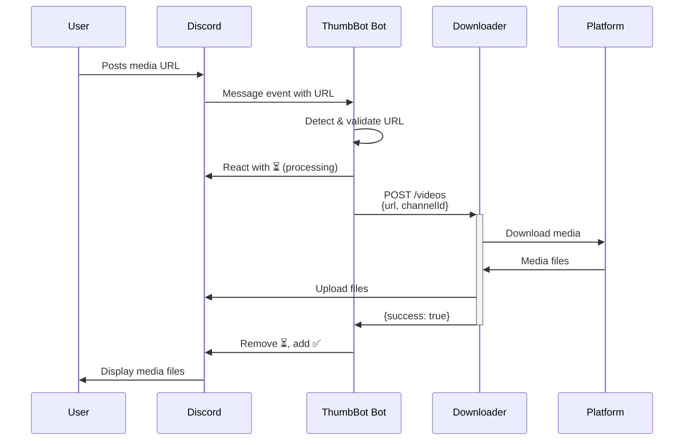

# 🤖 ThumbBot Discord Bot

Node.js/TypeScript Discord bot that automatically detects media URLs in Discord messages and coordinates with the downloader service to fetch and upload media files.

## 🎯 Service Overview

- **Discord Integration** with automatic link detection
- **Multi-platform Support** for 15+ social media platforms
- **Real-time Feedback** with emoji reactions and status updates
- **Downloader API Integration** via HTTP requests
- **Error Handling** with user-friendly messages

**Technology Stack:** Node.js/TypeScript, Discord.js, winston, prometheus-client

## 🤖 Bot Features

### Supported Platforms
| Platform | Videos | Images | Albums | Notes |
|----------|--------|--------|--------|-------|
| Instagram | ✅ | ✅ | ✅ | Posts, Reels, Stories |
| TikTok | ✅ | ❌ | ✅ | No watermark |
| YouTube | ✅ | ❌ | ❌ | Videos, Shorts |
| Twitter/X | ✅ | ✅ | ✅ | Media posts |
| Reddit | ✅ | ✅ | ❌ | Public posts |
| Streamable | ✅ | ❌ | ❌ | Direct links |

### Link Detection & Processing
- **Automatic Detection:** Monitors all messages for supported URLs
- **URL Validation:** Checks platform support before processing
- **Concurrent Processing:** Handles multiple links in single message
- **Rate Limiting:** Respects Discord API rate limits

### User Interaction & Feedback
- **Processing Indicator:** ⏳ reaction while downloading
- **Success Confirmation:** ✅ reaction when complete
- **Error Feedback:** ❌ reaction with error message
- **Progress Updates:** Real-time status in logs

### Multi-file Album Support
- **Instagram Albums:** Downloads all images in carousel posts
- **TikTok Image Posts:** Handles multi-image TikTok posts
- **Single Message Upload:** All files uploaded together
- **Original Quality:** Preserves image/video quality

## 🔧 Discord Integration

### Required Bot Permissions
```
Text Permissions:
✅ View Channels
✅ Send Messages  
✅ Add Reactions
✅ Attach Files
✅ Read Message History

General Permissions:
✅ Use Slash Commands (future)
```

### Bot Setup (Discord Developer Portal)
1. **Create Application:** https://discord.com/developers/applications
2. **Create Bot User:** Go to "Bot" section
3. **Get Bot Token:** Copy token for `DISCORD_TOKEN`
4. **Set Permissions:** Use permission calculator: `274877910016`
5. **Invite Bot:** Generate invite URL with permissions

### Guild Configuration
- **Automatic Operation:** No guild-specific configuration needed
- **Channel Access:** Bot processes messages in all accessible channels
- **Permission Checks:** Validates upload permissions per channel

### Message Handling Flow


## 🔗 API Integration

### Downloader Service Communication
- **Endpoint:** `POST http://thumbbot-downloader:8001/videos`
- **Payload:** `{url: string, channelId: string}`
- **Response:** `{success: boolean, message: string}`

### Request Format & Error Handling
```typescript
// Successful request
const response = await fetch(`${downloaderUrl}/videos`, {
  method: 'POST',
  headers: { 'Content-Type': 'application/json' },
  body: JSON.stringify({
    url: messageUrl,
    channelId: message.channel.id
  })
});

// Error handling
if (!response.ok) {
  await message.react('❌');
  logger.error(`Download failed: ${response.statusText}`);
  return;
}
```

### Retry Logic & Timeout Handling
- **Connection Timeout:** 30 seconds for downloader requests
- **Retry Attempts:** 2 retries on network failures
- **Rate Limiting:** Respects both Discord and downloader limits
- **Error Propagation:** User-friendly error messages

## ⚙️ Configuration Reference

| Variable | Default | Description |
|----------|---------|-------------|
| `DISCORD_TOKEN` | *(required)* | Discord bot token |
| `DOWNLOADER_HOST` | `thumbbot-downloader` | Downloader service hostname |
| `DOWNLOADER_PORT` | `8001` | Downloader service port |
| `LOG_LEVEL` | `info` | Logging level: debug/info/warn/error |
| `PORT` | `3000` | Bot API server port |
| `METRICS_PORT` | `3001` | Prometheus metrics port |
| `NODE_ENV` | `production` | Environment mode |

### Provider Settings (providers.json)
```json
{
  "providers": [
    {"name": "instagram.com", "enabled": true},
    {"name": "tiktok.com", "enabled": true},
    {"name": "youtube.com", "enabled": true},
    {"name": "twitter.com", "enabled": true},
    {"name": "reddit.com", "enabled": true}
  ]
}
```

## 🛠️ Development Setup

### Local Development
```bash
# Install dependencies
npm install

# Configure environment
cp .env.example .env
# Edit .env: DISCORD_TOKEN=your_bot_token_here

# Start development server
npm run dev

# Build for production
npm run build
npm start
```

### Testing
```bash
# Run all tests
npm test

# Run specific test file
npm test -- src/tests/logger.test.ts

# Run with coverage
npm run test:coverage
```

### Docker Development
```bash
# Build image
docker build -t thumbbot-bot .

# Run container
docker run -p 3000:3000 \
  -e DISCORD_TOKEN=your_token_here \
  -e DOWNLOADER_HOST=host.docker.internal \
  thumbbot-bot
```

## 🏗️ Code Structure
```
thumbot_bot/
├── src/
│   ├── index.ts            # Main entry point
│   ├── bot/
│   │   └── discord.ts      # Discord bot logic
│   ├── server/
│   │   └── server.ts       # Express API server
│   ├── services/
│   │   └── api.ts          # Downloader API client
│   ├── utils/
│   │   ├── logger.ts       # Logging configuration
│   │   └── metrics.ts      # Prometheus metrics
│   └── tests/              # Test suite
├── providers.json          # Platform configuration
├── package.json           # Dependencies
├── tsconfig.json          # TypeScript config
└── Dockerfile             # Container config
```

## 🎮 Commands & Interactions

### Automatic Link Detection
**User Action:** Posts any supported media URL in Discord

**Bot Response:**
1. Immediately reacts with ⏳ (processing)
2. Sends URL to downloader service
3. Waits for download completion
4. Removes ⏳, adds ✅ (success) or ❌ (error)

**Examples:**
```
User: "Check this out! https://www.instagram.com/p/DMsrx6ysS-v/"
Bot: [⏳ reaction] → [processes] → [✅ reaction + 3 images uploaded]

User: "https://www.youtube.com/watch?v=dQw4w9WgXcQ"
Bot: [⏳ reaction] → [processes] → [✅ reaction + video uploaded]
```

### Error Messages & User Feedback
| Scenario | Bot Response |
|----------|--------------|
| **Unsupported URL** | ❌ reaction (no message spam) |
| **Download Failed** | ❌ reaction + error logged |
| **Network Error** | ❌ reaction + retry attempt |
| **File Too Large** | ❌ reaction (file exceeds Discord limit) |
| **Success** | ✅ reaction + media files |

### Admin Features
*Currently none - all features are automatic*

## 🚨 Error Handling & Logging

### Error Types
```typescript
// Network errors
catch (error) {
  if (error.code === 'ECONNREFUSED') {
    logger.error('❌ Downloader service unavailable');
  }
}

// Discord API errors  
catch (error) {
  if (error.code === 50013) {
    logger.error('❌ Missing permissions in channel');
  }
}

// URL validation errors
if (!isValidUrl(url)) {
  logger.warn('⚠️ Invalid URL format detected');
  return;
}
```

### Logging Configuration
**Log Format:**
```
LEVEL    | message
INFO     | ✅ Bot logged in as ThumbBot#1234 | Serving 5 guilds
INFO     | 🔗 Detected instagram.com/reel link
ERROR    | ❌ Video request failed: fetch failed
```

**Log Levels:**
- `debug`: Detailed Discord.js events
- `info`: Standard bot operations
- `warn`: Recoverable issues
- `error`: Serious errors requiring attention

## 📊 Usage Examples

### Single Video Processing
```
User Message: "https://www.youtube.com/watch?v=dQw4w9WgXcQ"

Bot Process:
1. Detects YouTube URL
2. Validates URL format
3. Reacts with ⏳
4. POST to downloader: {url, channelId}
5. Downloader downloads video
6. Downloader uploads to Discord
7. Bot receives success response
8. Bot removes ⏳, adds ✅

Result: Video appears in Discord channel
```

### Instagram Album Processing  
```
User Message: "https://www.instagram.com/p/DMsrx6ysS-v/"

Bot Process:
1. Detects Instagram URL
2. Validates URL format
3. Reacts with ⏳
4. POST to downloader: {url, channelId}
5. Downloader gets picker with 3 images
6. Downloader downloads all 3 images
7. Downloader uploads all 3 in single message
8. Bot receives success response
9. Bot removes ⏳, adds ✅

Result: 3 images appear in single Discord message
```

### Error Handling Example
```
User Message: "https://invalid-platform.com/video/123"

Bot Process:
1. Detects URL
2. Validates format (passes basic check)
3. Reacts with ⏳
4. POST to downloader: {url, channelId}
5. Downloader returns error: "Platform not supported"
6. Bot receives error response
7. Bot removes ⏳, adds ❌
8. Error logged for debugging

Result: ❌ reaction, no spam message
```

## 📈 Monitoring & Metrics

### Health Check
```bash
curl http://localhost:3000/health
# Response: {"status": "healthy"}
```

### Prometheus Metrics
**Endpoint:** `http://localhost:3001/metrics`

**Available Metrics:**
- `bot_messages_processed_total` - Total messages processed
- `bot_links_detected_total` - Links detected by platform
- `bot_download_requests_total` - Requests sent to downloader
- `bot_errors_total` - Errors by type
- `bot_guilds_total` - Number of Discord servers

### Performance Monitoring
```bash
# Check bot status
curl http://localhost:3000/health

# View metrics
curl http://localhost:3001/metrics

# Monitor logs
docker logs thumbbot-bot -f
```

## 🔧 Troubleshooting

### Bot Not Responding to Links
```bash
# Check bot permissions in Discord server
# Verify bot token is valid
docker logs thumbbot-bot

# Test downloader connectivity
curl -X POST http://localhost:8001/videos \
  -H "Content-Type: application/json" \
  -d '{"url": "https://www.youtube.com/watch?v=test", "channelId": "123"}'
```

### Common Issues
| Issue | Solution |
|-------|----------|
| **Bot offline** | Check `DISCORD_TOKEN` validity |
| **No reactions** | Verify "Add Reactions" permission |
| **No uploads** | Check "Attach Files" permission |
| **Network errors** | Verify downloader service connectivity |
| **Rate limited** | Bot will automatically retry |

### Debug Mode
```bash
# Enable debug logging
LOG_LEVEL=debug npm run dev

# Check Discord.js debug output
DEBUG=discord.js:* npm run dev
```

## 🔗 Related Documentation

- **[Main System](../README.md)** - Complete system overview  
- **[Downloader Service](../thumbot_downloader/README.md)** - API integration details
- **[Architecture](../ARCHITECTURE.md)** - System design and flows

## 🤝 Contributing

1. Fork the repository
2. Create feature branch: `git checkout -b feature/new-feature`
3. Write tests for new functionality
4. Ensure all tests pass: `npm test`
5. Submit pull request with clear description

For support and bug reports, please use the main project repository.